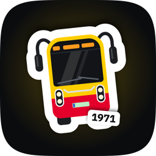
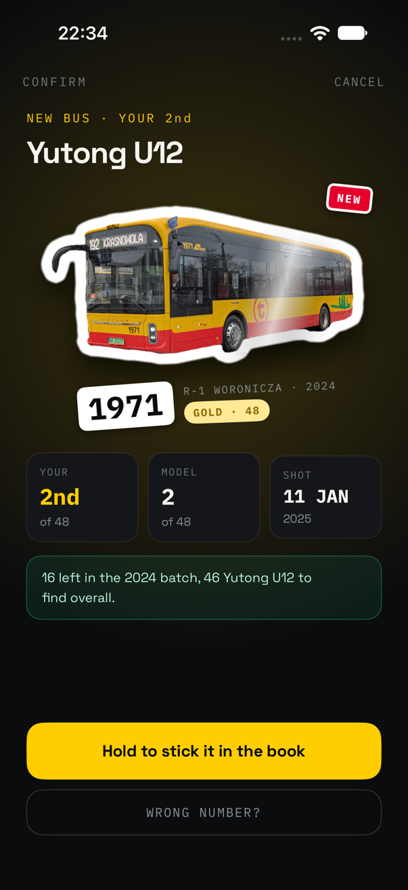
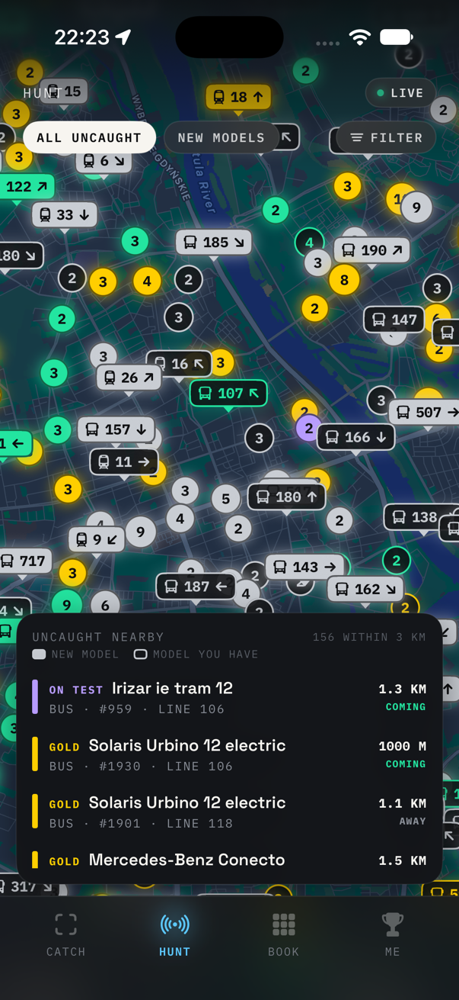
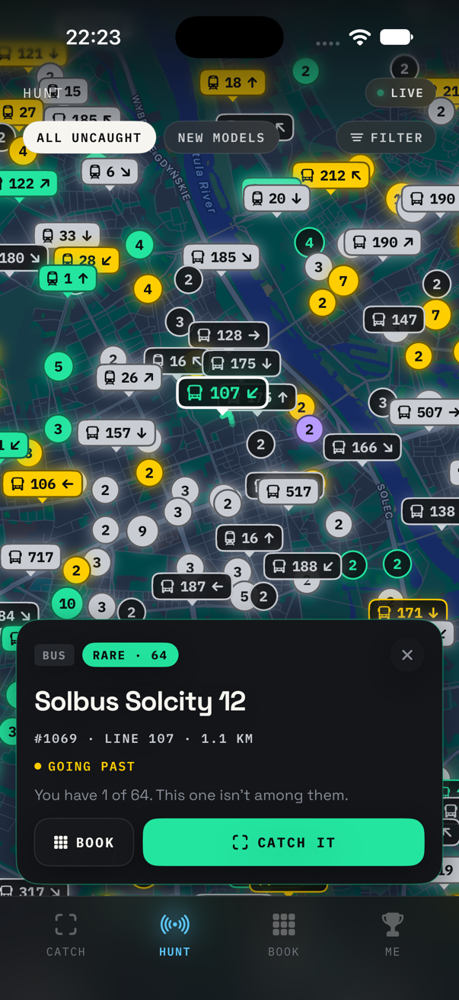
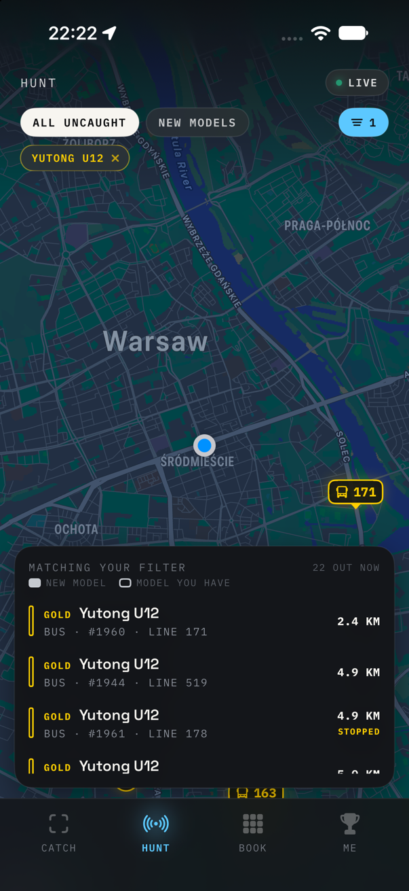
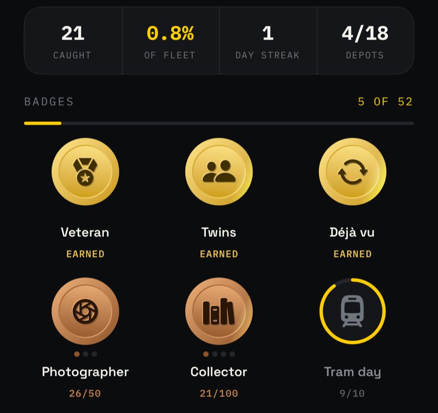

<div align="center">


<h1>TABOR</h1>

<p>
  <strong>A Pokédex for Warsaw's buses and trams.<br>
  Point the camera at one, and its fleet number goes into your book<br>
  as a die-cut sticker — the rarer the model, the louder it lands.</strong>
</p>

<p>
  
  
  
  
</p>



<p>
  <sub>Yutong U12 #1971, the bus on the app icon. Photo by
  <a href="https://commons.wikimedia.org/wiki/File:Yutong_Osiedle_Kabaty.jpg">J2 kolej</a>,
  <a href="https://creativecommons.org/licenses/by-sa/4.0/">CC BY-SA 4.0</a>, cut into a sticker by TABOR.</sub>
</p>

</div>

"Tabor" is Polish for rolling stock. Warsaw runs about 2 700 buses and trams,
split across 76 models. Some models have hundreds of vehicles, and some have four.
Every vehicle carries a fleet number, and the ZTM database says which model each
number belongs to. So a photo of a bus is enough to know exactly what you've
seen, and a list of every number is enough to know what you haven't.

TABOR does both halves. **CATCH** reads the fleet number on-device while you
frame the shot. **BOOK** files the vehicle under its model and batch. **HUNT**
shows every vehicle you haven't caught yet, live, on a map. **ME** keeps the
score.

---

## Install

There's no App Store build. Open the project in Xcode 27 and run it on
your phone:

```bash
open Tabor.xcodeproj
```

Set your own team under Signing & Capabilities for both the `Tabor` and
`TaborControls` targets. A free personal team works; that's also why there's no
iCloud sync (see [Your book](#your-book)).

The live map and the live-assisted number reading need a key for Warsaw's open
data API. It's free from [api.um.warszawa.pl](https://api.um.warszawa.pl). Put it
in a new, gitignored file next to `Config/Tabor.xcconfig`:

```bash
echo 'TABOR_UM_KEY = your-key-here' > Config/Secrets.xcconfig
```

Without a key the app still builds and catches work. HUNT stays empty until you
paste a key into Settings › Live data.

---

## CATCH

- **The number is read while you frame the shot.** Vision's text recogniser
  looks at about five frames a second. A number only counts once it has won
  three of the last six frames, so one bad frame can't lock the wrong one. Once
  it locks, the brackets tighten and turn yellow, the pill says which model it
  is and which year its batch was built, and the phone gives one click (two if
  you've never seen that vehicle).
- **Only fleet numbers count.** A photo of a bus is full of other digits: line
  numbers, times on the destination display, and the registration plate.
  - Runs glued to letters are dropped, and so are runs after a two- or three-letter
    county code (`WX 2043F`, `WPI 12345`). "Nr 1974" still counts.
  - Times and decimals (`20:15`, `3.14`) are dropped.
  - A number the database doesn't know is only kept if it's four digits long.
- **It knows what's around you.** With a location fix and the live feed, a number
  that belongs to a vehicle within 300 m gets a boost. If the read is one digit
  off a vehicle within 150 m (OCR turning 4235 into 1235), that vehicle is
  offered too. When a number belongs to both a bus and a tram, whichever one is
  actually nearby settles it, and the catch gets its line number from the feed.
- **BUS / TRAM / AUTO is a preference, not a filter.** A bus number read in TRAM
  mode still matches the bus. Spotters forget to switch back.
- **The shot is what you framed.** The viewfinder is a 3:2 photo frame, and the
  saved shot is cropped to it. Zoom has one button per real lens (0.5×, 1×, 2×,
  5× on a 16 Pro), so 5× is the telephoto rather than a crop of the main lens, and
  the phone clicks as you cross from one lens to the next.
- **Or import one.** A photo from the library works too, with its own date and
  place from the EXIF data. It doesn't touch today's streak. Reading a still image
  takes longer: if the whole frame gives nothing, it's read again as nine
  overlapping tiles, so a small number on a whole-vehicle shot has enough pixels.
- **Wrong read?** The correction sheet takes a number, a model and a line. It lists
  the database's matches first. A model you pick by hand is remembered for that
  number, but only when it disagrees with ZTM.

### The reveal

This is the screenshot at the top. The photo develops while the vehicle is lifted off the background. That's the
same subject-lifting model as the Photos app, running on the phone. It gets a thick white
border that follows its outline, and the sticker slams down with a haptic
pattern that gets longer the rarer the model is. A COMMON lands with one thunk. A
LEGENDARY builds up in step with its glow, hits on the frame you see it land,
and ends in sparks.

A line underneath says what the catch means for your book:

> One more — 1987 — and the 2024 batch is done.

Hold the sticker to peel it off the backing and stick it in the book.

---

## HUNT

<div align="center">
  
  
  
</div>

<p align="center">
  <sub>Everything uncaught within 3 km, rarest first: the Irizar on trial is 1.3 km off and coming.<br>
  One vehicle, and whether it's coming your way. And filtered down to one model: every<br>
  Yutong U12 out in the city right now, nearest first.</sub>
</p>

Every bus and tram you haven't caught, from Warsaw's live GPS feed, refreshed
every 15 seconds while the map is on screen, and never in the background.

- **Two kinds of marker.** A vehicle on its own is a tag with its line number. Vehicles that would
  overlap become one bubble with a count. Filled means a model you don't have
  yet, and outlined means a model you have but not this vehicle. The colour is always
  the tier.
- **Groups hold still.** The bubbles are fixed squares on the map, not clusters
  around the vehicles, so they don't jump about every 15 seconds as the buses move. They
  only regroup when you really zoom.
- **Which way it's going.** The feed only says where a vehicle is. So TABOR
  keeps the last five minutes of positions and draws an arrow once a vehicle has
  gone 30 m. The card says whether it's coming your way, going past, heading
  away or stopped.
- **A wanted list.** The filter takes whole tiers or particular models. While it's on,
  HUNT searches the whole city, not just the 3 km around you, and sorts by
  distance: if you're after one particular model, how far away it is matters most.
- **Rarest first.** Unfiltered, the list shows models you don't have yet first,
  then goes by rarity, then by distance. Vintage and test vehicles sit at the end
  of the book, but one that's actually out running is as rare a sight as a
  LEGENDARY, so HUNT ranks them with the legendaries.

---

## BOOK

Every model, with every vehicle ZTM lists, split into batches by build year and
depot:

```
2024 BATCH · R-1 WORONICZA · 1970—1987
```

Owned stickers come first, then the gaps. A batch turns green once you have the
whole batch.

| Tier | What it takes |
| :--- | :--- |
| **LEGENDARY** | A model with 12 vehicles or fewer |
| **GOLD** | 48 or fewer |
| **RARE** | 80 or fewer |
| **COMMON** | Everything bigger |
| **VINTAGE** | Tourist and museum vehicles, only out on summer weekends and at events |
| **ON TEST** | Trial vehicles on loan to an operator, here for a few weeks |

Rarity is fleet size and nothing else. There's no guessing at how often a model
runs. VINTAGE and ON TEST are tiers of their own, whatever their size, and
neither counts toward the fleet percentage or the "complete a tier" badges.
They aren't rare, they're seasonal or passing through.

A vehicle's page has its age, when you first saw it, how many times you've
seen it, and every sighting: when, where (district and street), and which line
it was on. Swipe a sighting to fix its number, model or line, or delete it.

---

## ME

<div align="center">
  
</div>

- **The trophy shelf:** your three rarest stickers. Then **caught**, the
  **fleet share** (to one decimal place under 10%, so the first few hundred
  catches visibly move it), the **day streak**, and how many **depots** you've
  caught vehicles from.
- **52 badges**, drawn as struck coins. Drag one to spin it: it has a rim and an
  engraved back, and the phone clicks on every quarter turn. Some are tiered, from bronze up to
  platinum (Collector, Fleet share, Line hopper, Photographer). Others are for
  one thing: *Unicorn* (the only vehicle of its model in Warsaw), *Twins*
  (back-to-back fleet numbers), *Double life* (a bus and a tram with the same
  number), *Rainbow day*, *Every district*, one badge per depot. A few stay
  secret until you earn them.
- **Weather badges** (snow, rain, heatwave, deep freeze, a thunderstorm) look up
  each geotagged catch in Open-Meteo's archive afterwards. That's the one thing
  TABOR sends off the phone: a catch's time and its rough position (to about
  1 km). It can be switched off in Settings.
- **Share a catch** as a 4:5 card: the sticker under a spotlight in its tier's
  colour, the number tag, and where and on which line you caught it.

### Outside the app

- **A Home and Lock Screen widget** with your streak, how many vehicles you've
  caught out of the fleet, and your latest sticker.
- **A catch control** for Control Center, the Lock Screen and the Action button,
  which opens straight into the camera. "Catch a vehicle" is also in Siri,
  Spotlight and Shortcuts.

---

## Fleet data

`Tabor/Resources/fleet.json` is built by `scripts/fetch_fleet.py` from the ZTM
vehicle database. On top of that come hand-kept lists for what the database
doesn't have yet or has wrong: new deliveries already running, buses on trial,
club-owned vintage buses, retired vehicles still listed, and vehicles filed under
the wrong model. The script's header explains each list.

```bash
python3 scripts/fetch_fleet.py --offline
```

Rebuilds from the saved scrape in `data/` in seconds. Leave out `--offline` to
scrape ZTM again, which takes a while. ZTM blocks GitHub's runners, so the scrape
runs from a home connection, not in CI.

**New buses don't need an app update.** The app checks this repo's `main` for a
newer `fleet.json` once a day and uses it from the next launch. A downloaded
copy only wins while it's newer than the one built into the app, so an app update
with fresher data is never overridden by an old download. Settings can turn the
check off.

Hand-added numbers come from a source (Warszawikia, TransInfo, the KMKM club,
phototrans.eu) or were seen live on the feed. None are filled in from an order
size. As soon as ZTM lists a number itself, ZTM's row wins and the hand-added one
drops out. Every source is credited at the bottom of the book.

> [!NOTE]
> The live feed and the database don't always agree. The feed keeps some
> vehicles' last positions for years, so anything older than three minutes is
> ignored. A vehicle the database doesn't know never shows on HUNT, because
> TABOR couldn't say which model it is.

---

## Your book

It lives on the phone and nowhere else: there's no account and no server. iCloud
sync needs a CloudKit entitlement, which a personal signing team can't have.
Settings › Backup exports the whole book as a ZIP: every sighting, photo, sticker
and hand-picked model. Importing a backup only adds what's missing, so importing
the same file twice changes nothing.

Location is only used while the app is on screen: it geotags a catch and tells
HUNT and the camera what's nearby. There's no background location mode at all.

**Debug mode** (Settings) saves every shot to Files › On My iPhone › TABOR ›
Debug, including failed reads and retakes. Each shot is saved with the photo, the sticker and what the OCR, the live feed and
the sticker cutter made of it. With debug mode on, long-pressing a caught sticker in the book
deletes it.

---

## Tests

The matching, OCR filtering, stats, badges, live feed parsing and backup logic
in `Tabor/Core` doesn't depend on the iPhone. It also builds as a Swift package,
so it's tested on a Mac in about a second:

```bash
swift test
```
