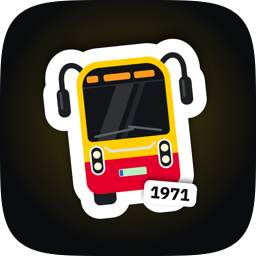
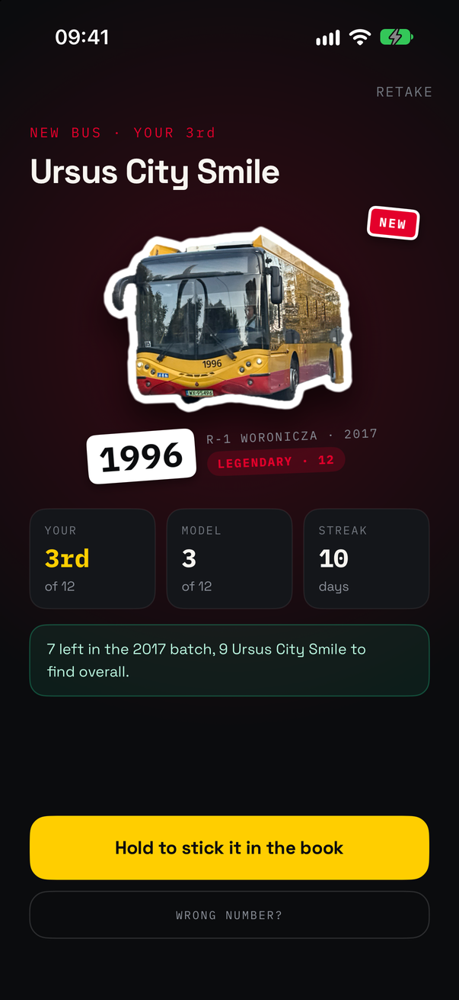
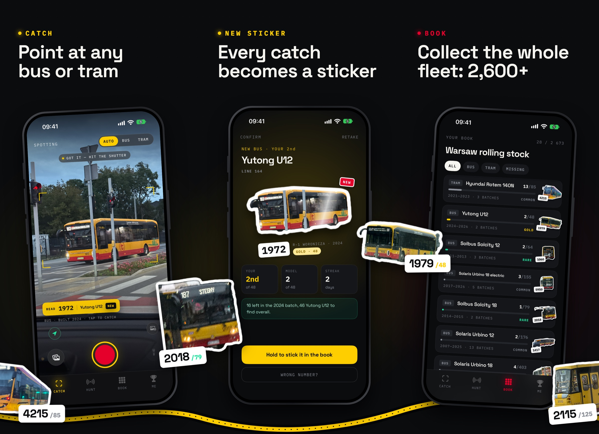
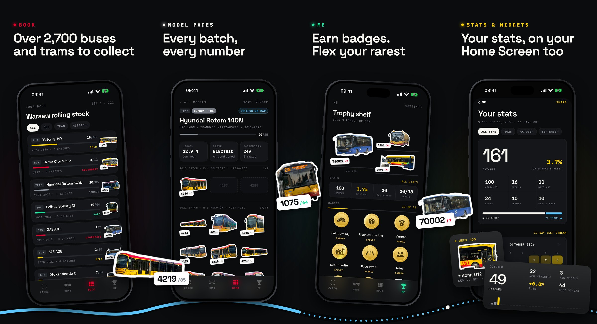
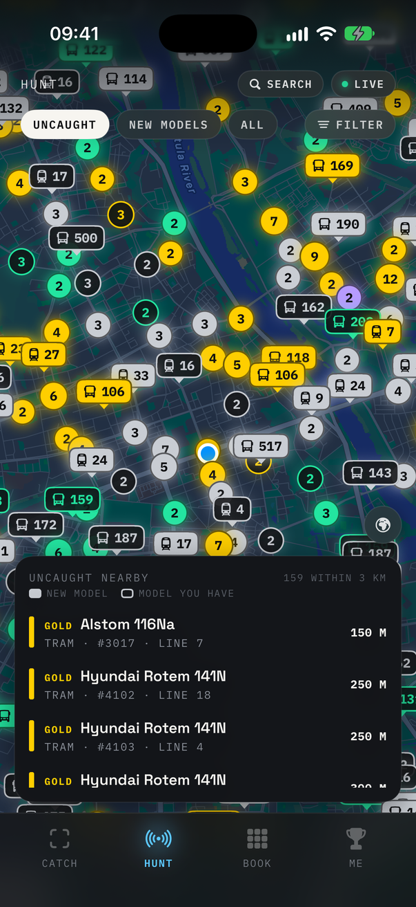
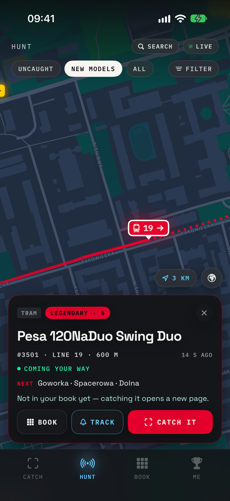
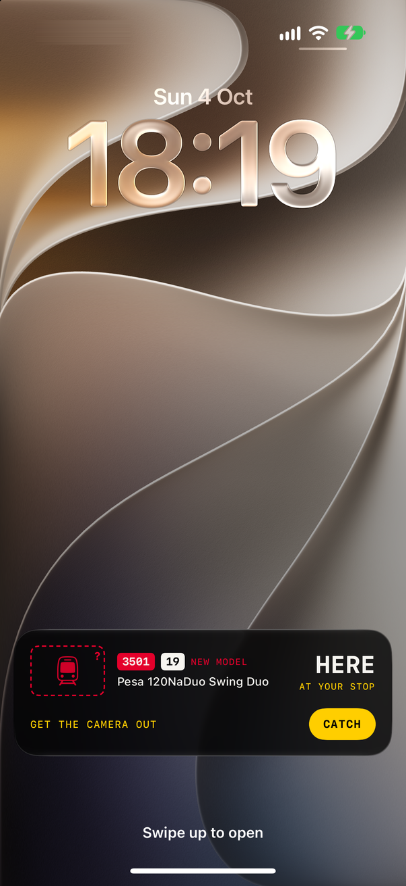
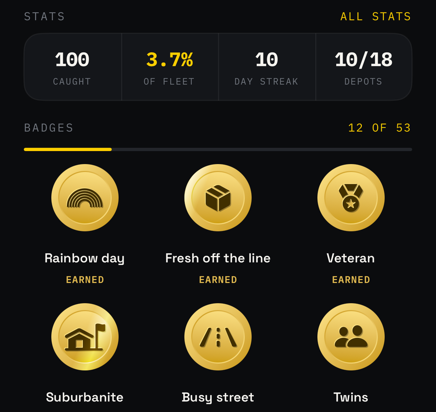
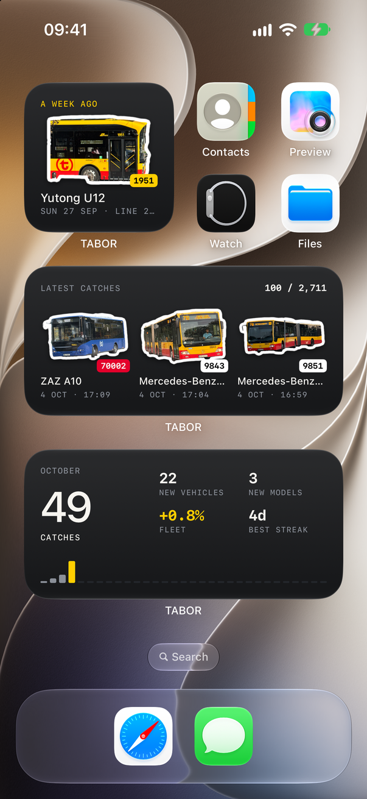

<div align="center">


<h1>TABOR</h1>

<p>
  <strong>A Pokédex for Warsaw's buses and trams.<br>
  Point the camera at one, and its fleet number goes into your book<br>
  as a die-cut sticker — the rarer the model, the louder it lands.</strong>
</p>

<p>
  
  
  
  
</p>



<p>
  <sub>Ursus City Smile #1996, one of only twelve in Warsaw, caught through a car's windscreen.</sub>
</p>

</div>

"Tabor" is Polish for rolling stock. Warsaw runs about 2 700 buses and trams
in regular service, split across 44 models. Some models have hundreds of
vehicles, and some have four. On top of that come 35 kinds of museum and club
vehicles, and the odd bus on trial. Every vehicle carries a fleet number, and
ZTM's database says which model each number belongs to. So a photo of a bus is
enough to know exactly what you've seen, and a list of every number is enough to
know what you haven't.

TABOR does both halves. **CATCH** reads the fleet number on the phone while you
frame the shot. **BOOK** files the vehicle under its model and batch. **HUNT**
shows every vehicle you haven't caught yet, live, on a map, and follows one to
your stop on the Lock Screen. **ME** keeps the score.

<p align="center">
  
  
</p>

---

## Install

**Po polsku:** opis i instalacja na [thefilip.com/tabor](https://thefilip.com/tabor).

**Try the beta on TestFlight:** [testflight.apple.com/join/rt5RfQJ1](https://testflight.apple.com/join/rt5RfQJ1)
(iPhone, iOS 18 or later). Screenshots with TestFlight's feedback are the best
bug reports, and issues here work too.

Or build it yourself. Open the project in Xcode 27 and run it on your phone:

```bash
open Tabor.xcodeproj
```

Set your own team under Signing & Capabilities for the `Tabor`, `TaborControls`
and `TaborShare` targets.

The live map and the live-assisted number reading use Warsaw's open data. The
app doesn't carry a key: it asks TABOR's proxy (`proxy/`, a Cloudflare Worker
running in Warsaw), which holds the key, keeps each copy of the feed for 3
seconds so phones share one call to the city, gzips it, and allows each address
60 calls a minute. Builds from this repo use that proxy as they are. To go
direct instead, paste a free key from
[dane.um.warszawa.pl](https://dane.um.warszawa.pl/en/key-api) into Settings › Live data. To
run your own proxy, change the domain in `proxy/wrangler.toml` and
`TABOR_LIVE_PROXY` in `Config/Tabor.xcconfig`, then:

```bash
cd proxy && npx wrangler secret put DANE_TOKEN && npx wrangler deploy
```
---

## CATCH

- **The number is read while you frame the shot.** Vision's text recogniser
  looks at about five frames a second. A number only counts once it has won
  three of the last six frames, so one bad frame can't lock the wrong one. Once
  it locks, the brackets tighten and turn yellow, the pill says which model it
  is and which year its batch was built, and the phone gives one click (two if
  you've never seen that vehicle).
- **Only fleet numbers count.** A photo of a bus is full of other digits: line
  numbers, times on the destination display, and the registration plate.
  - Runs glued to letters are dropped, and so are runs after a two- or three-letter
    county code (`WX 2043F`, `WPI 12345`), and plate digits that start with 0.
    "Nr 1974" still counts, and so does a number with paint glued on.
  - Times and decimals (`20:15`, `3.14`) are dropped.
  - A number the database doesn't know is only kept if it's four digits long.
  - One letter that looks like a digit (`1O23`, `I974`) is read as that digit, but
    only when that makes a number in the fleet, and it ranks below a clean read.
  - When a photo shows only a short number, it's read again more closely, so a
    line number isn't taken for the fleet number.
- **It knows what's around you.** With a location fix and the live feed, a number
  that belongs to a vehicle within 300 m gets a boost. If the read is one digit
  off a vehicle within 150 m (OCR turning 4235 into 1235), that vehicle is
  offered too, though a clean read of a real number still wins. When a number
  belongs to both a bus and a tram, whichever one is actually nearby settles it,
  and the catch gets its line number from the feed.
- **More than one in the shot.** Other vehicles in the photo are offered on the
  reveal as chips ("+ 5918 · ALSO IN SHOT"), each with its own sticker, and saved
  as catches of their own. With the live feed they have to be running nearby.
- **Coupled trams count twice.** Konstal 105Na, 105N2k and Cegielski 123N run as
  two cars, each with its own number, but the live feed reports a set under one
  of them. So the other car isn't "fixed" into its neighbour: it's kept as read,
  and it takes the set's line. The reveal offers **+ SECOND CAR**, suggesting the
  other number (from the photo, the feed or the next number along), and both cars
  go in the book.
- **BUS / TRAM / AUTO is a preference, not a filter.** A bus number read in TRAM
  mode still matches the bus. Spotters forget to switch back.
- **The shot is what you framed.** The viewfinder is a 3:2 photo frame, and the
  saved shot is cropped to it. Zoom has one button per real lens (0.5×, 1×, 2×,
  5× on a 16 Pro), so 5× is the telephoto rather than a crop of the main lens, and
  the phone clicks as you cross from one lens to the next. The last button goes to
  twice the longest lens (10× on a 16 Pro), for a bus that's already pulling away.
- **Hardware buttons.** Either volume button takes the shot, and so does Camera
  Control, where sliding zooms in 0.1× clicks.
- **Or import one.** A photo from the library works too, with its own date and
  place from the EXIF data. It doesn't touch today's streak. **TABOR** is also in
  the share sheet, so a photo from Photos or any other app goes straight to the
  catch. Reading a still image takes longer: if the whole frame gives nothing,
  it's read again as nine overlapping tiles, so a small number on a whole-vehicle
  shot has enough pixels.
- **Wrong read?** The correction sheet takes a number, a model and a line. It lists
  the database's matches first, then the vehicles running nearby. A model you pick
  by hand is remembered for that number, but only when it disagrees with ZTM.

### The sticker

The photo develops while the vehicle is lifted off the background. That's the
same subject-lifting model as the Photos app, running on the phone. The sticker
is cut from the object the fleet number is painted on, so another bus or a car
alongside doesn't steal it. People standing in front of the vehicle are erased,
bike included, unless erasing them would bite into the vehicle. WRONG CUTOUT?
on the reveal tries the next object in the photo.

It gets a thick white border that follows its outline, and the sticker slams
down with a haptic pattern that gets longer the rarer the model is. A COMMON
lands with one thunk. A LEGENDARY builds up in step with its glow, hits on the
frame you see it land, and ends in sparks.

A line underneath says what the catch means for your book:

> One more — 1987 — and the 2024 batch is done.

Hold the sticker to peel it off the backing and stick it in the book.

---

## HUNT

<div align="center">
  
  
  
</div>

<p align="center">
  <sub>Everything uncaught within 3 km, rarest first. One tram picked out: it's<br>
  coming your way, three stops off. And TRACK follows it to your stop on the Lock Screen.</sub>
</p>

Every bus and tram you haven't caught, from Warsaw's live GPS feed. The feed is
read every 10 seconds while the map is on screen, every 30 seconds elsewhere in
the app (so trails are ready when you open the map), and never in the background.

- **Two kinds of marker.** A vehicle on its own is a tag with its line number. Vehicles that would
  overlap become one bubble with a count. Filled means a model you don't have
  yet, and outlined means a model you have but not this vehicle. The colour is always
  the tier.
- **Groups hold still.** The bubbles are fixed squares on the map, not clusters
  around the vehicles, so they don't jump about with every update as the buses move.
  They only regroup when you really zoom.
- **Which way it's going.** The feed only says where a vehicle is. So TABOR
  keeps the last ten minutes of positions, laid along the street, and draws an arrow
  once a vehicle has gone 30 m. Each card says how old its position is.
- **Where it goes next.** Every line's route comes from ZTM's timetable data
  (GTFS), rebuilt daily. A picked vehicle is placed on its route: a dotted line
  shows where it goes next, the card lists its next stops and where its run
  ends, and the pin creeps along to where it should be now between updates. It's
  only COMING YOUR WAY if its route actually passes you; otherwise it TURNS OFF
  before you.
- **TRACK it.** While a vehicle is coming, TRACK puts it on the Lock Screen and
  in the Dynamic Island: how far away it is, how many stops are left, then HERE
  with a button that opens the camera. The proxy follows the vehicle and pushes
  each update, so it keeps going with the app closed.
- **The map follows the one you pick.** Move the map yourself and it stays where
  you put it, and FOLLOW brings it back. With a heading, your dot shows which way
  you're facing, and the map can turn to match.
- **A wanted list.** The filter takes buses or trams, whole tiers, particular
  models, and specs: length, drive and low floor. Any filter but the type alone
  makes HUNT search the whole city, not just the 3 km around you, and sort by
  distance: if you're after one particular model, how far away it is matters most.
  From outside Warsaw, a filter is the way in.
- **Search.** A fleet number finds that vehicle, running or not. A line lists
  every vehicle on it right now.
- **Three views.** UNCAUGHT shows everything not in your book, MISSING only
  models you don't have yet, and ALL shows everything running, caught or not. A
  vehicle you've caught gets the same marker as any other model you have, and its
  card says when it went into your book.
- **Rarest first.** Unfiltered, the list shows models you don't have yet first,
  then goes by rarity, then by distance. Vintage and test vehicles sit at the end
  of the book, but one that's actually out running is as rare a sight as a
  LEGENDARY, so HUNT ranks them with the legendaries.

---

## BOOK

Every model, with every vehicle ZTM lists, split into batches by operator,
build year and depot:

```
2024 BATCH · R-1 WORONICZA · 1970—1987
```

Owned stickers come first, then the gaps. A batch turns green once you have the
whole batch. Each model page has its length, drive, floor, air-con and how many
people it carries, every drive it comes in, and SHOW ON MAP for the ones running
now.

| Tier | What it takes |
| :--- | :--- |
| **LEGENDARY** | A model with 12 vehicles or fewer |
| **GOLD** | 48 or fewer |
| **RARE** | 80 or fewer |
| **COMMON** | Everything bigger |
| **VINTAGE** | Tourist and museum vehicles, only out on summer weekends and at events |
| **ON TEST** | Trial vehicles on loan to an operator, here for a few weeks |

Rarity is fleet size and nothing else. There's no guessing at how often a model
runs. VINTAGE and ON TEST are tiers of their own, whatever their size, and
neither counts toward the fleet percentage or the "complete a tier" badges.
They aren't rare, they're seasonal or passing through.

A vehicle's page has its age, when you first saw it, how many times you've
seen it, any special livery, and every sighting: when, where (district and street),
and which line it was on. A vehicle caught more than once shows the picture you
pick. Swipe a sighting to fix its number, model or line, or delete it. A
deleted sighting can be brought back with UNDO for a few seconds.

---

## ME

<div align="center">
  
</div>

- **The trophy shelf:** your three rarest stickers. Then **caught**, the
  **fleet share** (to one decimal place under 10%, so the first few hundred
  catches visibly move it), the **day streak**, and how many **depots** you've
  caught vehicles from.
- **53 badges**, drawn as struck coins. Drag one to spin it: it has a rim and an
  engraved back, and the phone clicks on every quarter turn. Some are tiered, from bronze up to
  platinum (Collector, Fleet share, Line hopper, Photographer). Others are for
  one thing: *Unicorn* (the only vehicle of its model in Warsaw), *Twins*
  (back-to-back fleet numbers), *Double life* (a bus and a tram with the same
  number), *Dressed up* (a special livery), *Rainbow day*, *Every district*,
  *Every operator*, one badge per depot. Tap one to see the vehicles that earned
  it, or what's still to find. A few stay secret until you earn them.
- **Weather badges** (snow, rain, heatwave, deep freeze, a thunderstorm) look up
  each geotagged catch in Open-Meteo's archive afterwards. That's the one thing
  TABOR sends off the phone: a catch's time and its rough position (to about
  1 km). It can be switched off in Settings.
- **ALL STATS:** any month, year or all time, with catches, vehicles, models,
  lines and depots, buses against trams, a calendar of the days you were out, your
  hour and your day, and your top models, places, depots and lines. It shares as a
  story-sized card.
- **The catch log:** every catch, newest first, saying which ones were a new
  model or a new vehicle.
- **Where you spot:** a map of every geotagged catch. Tap a pin for that catch's
  sticker, when and where it was, and a way to its page.
- **Share a catch** as a 4:5 card: the sticker under a spotlight in its tier's
  colour, the number tag, and where and on which line you caught it.

### Outside the app

<div align="center">
  
</div>

- **Widgets:** *Stats* (a month, a year or all time, picked when you add it),
  *Memories* (what you caught a week, a month or a year ago today), *Your book*,
  *Latest catches*, *Rarity sets* and *Sticker shuffle*. Tap a sticker to open
  that vehicle.
- **Lock Screen tracking** in the Dynamic Island and on the Lock Screen (see HUNT).
- **Catch and Hunt controls** for Control Center, the Lock Screen and the Action
  button. "Catch a vehicle" is also in Siri, Spotlight and Shortcuts.

---

## Fleet data

`Tabor/Resources/fleet.json` is built by `scripts/fetch_fleet.py` from two
sources: the ZTM vehicle database, and the city's open-data vehicle list, which
adds numbers ZTM hasn't listed yet and each model's specs. On top of that come
hand-kept lists for what neither has yet or has wrong: new deliveries already
running, buses on trial, club-owned vintage buses, retired vehicles still listed,
vehicles filed under the wrong model, coupled trams, and special liveries
(confirmed from photos, since the city's paint data misses repaints). The
script's header explains each list.

```bash
python3 scripts/fetch_fleet.py --offline
```

Rebuilds from the saved files in `data/` in seconds. Leave out `--offline` to
fetch the city's list again, and add `--scrape` to scrape ZTM too, which takes a
while. ZTM blocks GitHub's runners, so the scrape runs from a home connection, not in CI.

**New buses don't need an app update.** The app checks this repo's `main` for a
newer `fleet.json` once a day and uses it from the next launch. A downloaded
copy only wins while it's newer than the one built into the app, so an app update
with fresher data is never overridden by an old download. Settings can turn the
check off. When a model is split in two, catches move to the right one by
themselves.

Hand-added numbers come from a source (Warszawikia, TransInfo, the KMKM club,
phototrans.eu) or were seen live on the feed. None are filled in from an order
size. As soon as ZTM lists a number itself, ZTM's row wins and the hand-added one
drops out. Every source is credited at the bottom of the book.

> [!NOTE]
> The live feed and the database don't always agree. The feed keeps some
> vehicles' last positions for years, so anything older than three minutes is
> ignored. A vehicle the database doesn't know never shows on HUNT, because
> TABOR couldn't say which model it is.

---

## Your book

It lives on the phone and nowhere else: there's no account, nothing of yours
goes to a server, and no iCloud sync for now. What the app does send (the live
feed, the weather, Lock Screen tracking) is listed in the
[privacy policy](https://thefilip.com/tabor/privacy). Settings › Backup exports the whole book as a ZIP: every
sighting, photo, sticker and hand-picked model. Importing a backup only adds
what's missing, so importing the same file twice changes nothing.

The book keeps its own copy of each catch's photo at 1600 px, a few hundred KB
as HEIC. The shot saved to Photos stays full size.

Location is only used while the app is on screen: it geotags a catch and tells
HUNT and the camera what's nearby. There's no background location mode at all.
Lock Screen tracking sends the proxy the vehicle's number, the stretch of its
route up to your stop, and the token it pushes updates to. It's forgotten when
tracking ends.

**Debug mode** (Settings) saves every shot to Files › On My iPhone › TABOR ›
Debug, including failed reads and retakes. Each shot is saved with the photo, the sticker and what the OCR, the live feed and
the sticker cutter made of it. With debug mode on, long-pressing a caught sticker in the book
deletes it.

---

## Tests

The matching, OCR filtering, stats, badges, live feed parsing, routes and backup
logic in `Tabor/Core` doesn't depend on the iPhone. It also builds as a Swift
package, so it's tested on a Mac in about a second:

```bash
swift test
```

The proxy's tracking maths has its own:

```bash
node proxy/src/trackgeo.test.mjs
```

GitHub Actions runs the Swift tests on every push to `main` and every pull request that
touches `Tabor/Core`, the tests or `fleet.json`.
